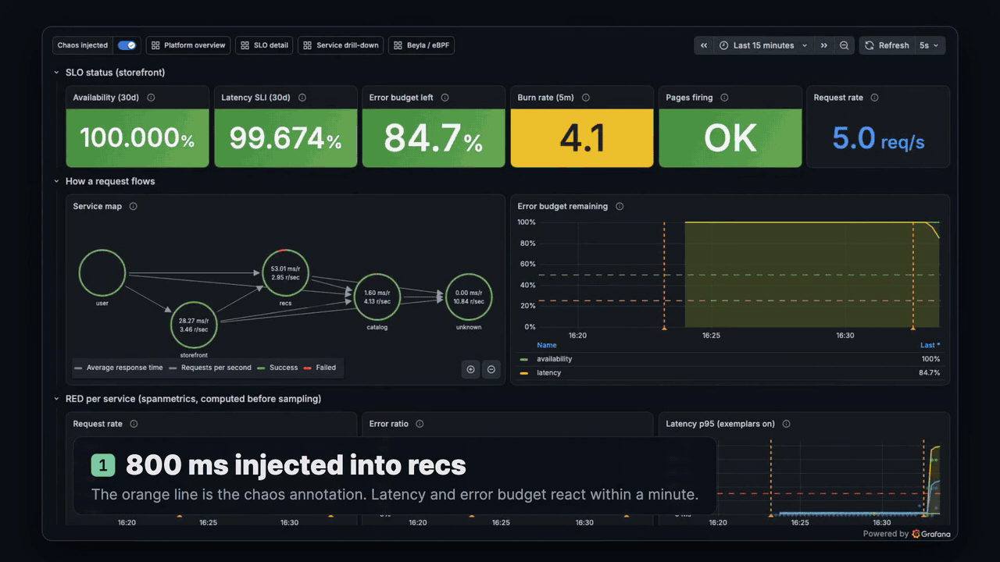
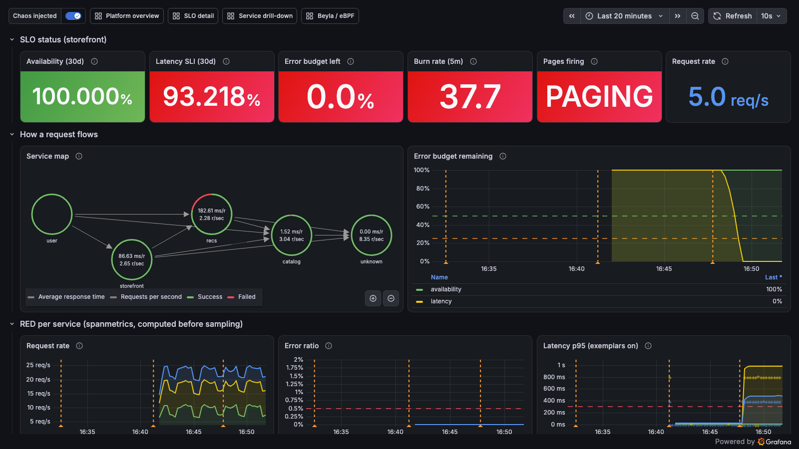
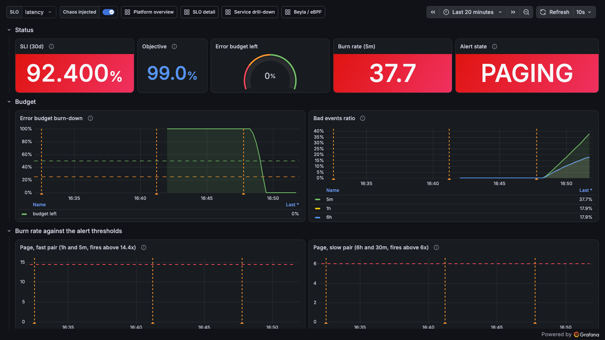
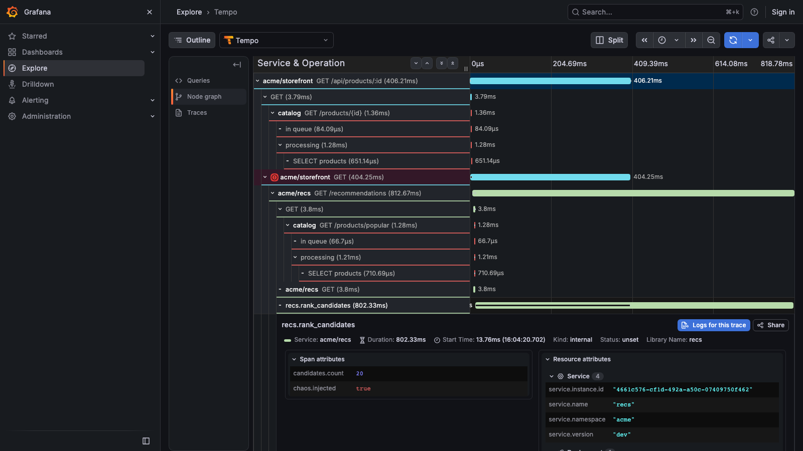
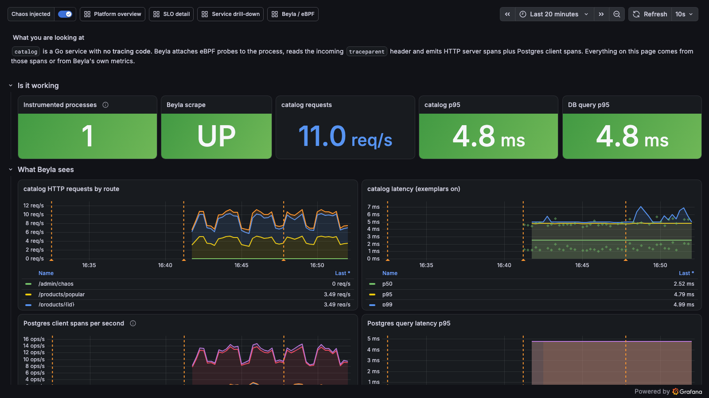
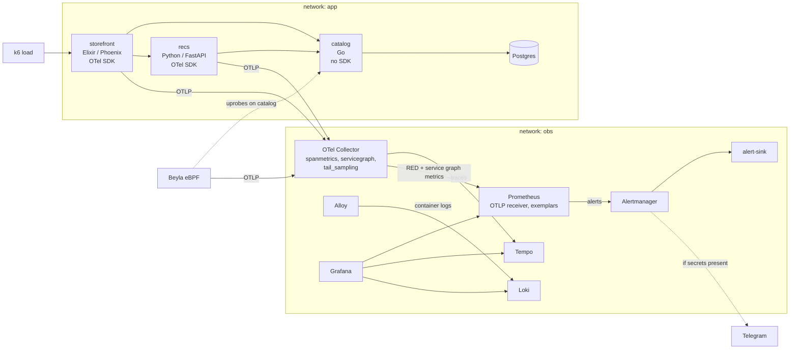
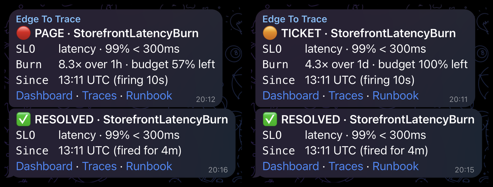

# edge-to-trace

> A runnable lab that takes a request from the edge to the exact slow span: SLO burn-rate alerts, exemplars,
> traces and logs wired together, with eBPF and SDK instrumentation side by side.

<p align="center">
  <a href="docs/media/edge-to-trace.mp4"></a>
</p>
<p align="center"><sub>Real footage from the lab: fault injected, burn-rate page, exemplar to trace. Click for the 60 second video (<a href="docs/media/edge-to-trace.mp4">MP4, 6 MB</a>).</sub></p>

Version 0.1 (profile `lite`). It runs on Docker Compose and needs about 4 GiB of memory for Docker.

## What this shows

- Alerts based on SLOs, not on raw thresholds: multi-window burn-rate rules generated from a spec and unit-tested. See [ADR-0007](docs/adr/0007-slo-with-sloth.md) and [docs/slo.md](docs/slo.md).
- One click from a latency graph to the trace to the logs of that request, using exemplars and `trace_id`. See [docs/architecture.md](docs/architecture.md).
- eBPF (Beyla) and the OpenTelemetry SDK side by side, and where each one works. See [ADR-0003](docs/adr/0003-mixed-instrumentation.md).
- A collector that computes RED metrics before sampling, so the SLO does not change when sampling does. See [ADR-0006](docs/adr/0006-otel-collector-hub.md).
- Every alert has a runbook, and a tested path to a notification. See [docs/runbooks/](docs/runbooks/) and [ADR-0008](docs/adr/0008-notification-path.md).

## Quick start

You need Docker with Compose v2, `make`, `openssl`, and about 4 GiB of memory for Docker.

```
git clone https://github.com/mqa8668/edge-to-trace.git
cd edge-to-trace
make demo
```

`make demo` starts the stack and walks through the chaos scenario below. `make demo-reset` undoes it.

<p align="center"></p>

Other commands:

| Command | What it does |
|---|---|
| `make up` | Create `.env` with random secrets, build, start the lite profile, wait until healthy |
| `make smoke` | API-level checks: targets up, traces, exemplars, logs, alert path |
| `make down` | Stop containers, keep data |
| `make clean` | Remove containers, volumes and local images (asks first) |
| `make doctor` | Check Docker, memory, kernel and Beyla |
| `make test`, `make lint` | Unit tests and config checks |

The Grafana admin password is in `.env`. Grafana also allows anonymous read-only access on localhost.

### Dashboards and endpoints

| What | URL |
|---|---|
| Platform overview | http://localhost:3000/d/e2t-overview |
| SLO detail (`var-slo=availability` or `latency`) | http://localhost:3000/d/e2t-slo |
| Service drill-down (`var-service`) | http://localhost:3000/d/e2t-service |
| Beyla / eBPF | http://localhost:3000/d/e2t-beyla |
| Prometheus | http://localhost:9090 |
| Alertmanager | http://localhost:9093 |
| Alert sink (received alerts) | http://localhost:9095/alerts |
| Storefront API | http://localhost:8080/api/products/1 |

## The scenario

1. Baseline. k6 sends 5 requests per second. The SLO dashboard is green, and `Watchdog` arrives at the alert sink every minute.
2. Run `make chaos-latency`. It adds 800 ms to 60% of calls to the `recs` service. The fault expires on its own after 15 minutes.
3. The `StorefrontLatencyBurn` page alert fires within minutes. You see it at http://localhost:9093 and http://localhost:9095/alerts (and in Telegram if you configured it).
4. Open the service drill-down and click an exemplar dot on the latency panel.
5. The trace opens in Tempo. The `recs.rank_candidates` span takes about 800 ms and has `chaos.injected=true`.
6. Click through to the logs of the same trace in Loki.
7. Run `make chaos-reset`.
8. The alert resolves. Resolving takes longer than detecting, because the 6h/30m window pair keeps the page firing for a while after the 5m/1h pair has cleared. This is expected; see the [latency runbook](docs/runbooks/storefront-latency-burn.md).

`make chaos-errors` does the same with 503s on `catalog` and fires `StorefrontAvailabilityBurn`.

## Screenshots

All of these come from the running lab with fictional Acme data.

<p align="center"></p>

Platform overview during the fault. The orange line marks the injected chaos.

<p align="center"></p>

SLO detail for latency: the burn rates cross the page thresholds and the budget is spent.

<p align="center"></p>

The exemplar's trace. The slow span is `recs.rank_candidates`, with `chaos.injected=true`.

<p align="center"></p>

The `catalog` service has no tracing code. Beyla produces these spans from the kernel.

## Architecture



More in [docs/architecture.md](docs/architecture.md).

## Telegram (optional)

Create `secrets/telegram_bot_token.txt` and `secrets/telegram_chat_id.txt`, then run `make up`. Messages look like this: a severity header, SLO, burn rate with remaining budget, start time with duration, and Dashboard, Traces and Runbook links.

<p align="center"></p>

Telegram forum topics are optional. If your chat is a group with Topics enabled, set the topic ids in `.env` (gitignored): `TELEGRAM_THREAD_PAGE`, `TELEGRAM_THREAD_TICKET` and `TELEGRAM_THREAD_HEARTBEAT`. Page alerts go to the first topic, ticket alerts to the second, and a silent one-line Watchdog heartbeat (every 12h) to the third. Unset or `0` sends everything to the main chat. `compose.telegram.yaml` writes the ids into the Alertmanager config at container start.

## Profiles

| Profile | Adds | Status | Docker memory |
|---|---|---|---|
| `lite` | Demo app, metrics, logs, traces, SLOs, chaos | v0.1, available | about 4 GiB |
| `edge` | HAProxy with TLS and rate limit, Coraza WAF, Suricata | planned, v0.2 | about 5 GiB |
| `full` | Wazuh SIEM | planned, v0.3 | about 14 to 16 GiB |
| `k8s` | kind and Cilium | planned, v0.4 | about 8 GiB |

## Sizing

Measured on a Linux 6.8 x86_64 VM with 12 vCPU, after about 45 minutes at 5 requests per second.

| | Value |
|---|---|
| Memory in use, all containers | about 1.54 GiB |
| Sum of configured `mem_limit` | about 4.2 GiB |
| CPU | about 45% of one core |
| Disk with default retention | under 5 GB |
| macOS Docker Desktop | pending, not yet measured |

Per-service numbers and why three limits were raised: [docs/sizing.md](docs/sizing.md).

## Security notes

- Every published port binds to `127.0.0.1`. Nothing is exposed to the network.
- No default credentials. `make up` generates the Postgres, Grafana and chaos secrets into `.env` (mode 600, gitignored).
- Third-party images are pinned by digest ([ADR-0009](docs/adr/0009-supply-chain-pinning.md)).
- Most containers drop all capabilities, run with `no-new-privileges` and a read-only root filesystem. Several run as non-root users.
- Exception: Beyla needs eBPF capabilities, including SYS_ADMIN. It is not privileged, but it is the one powerful container.
- Alloy reads the Docker API through a read-only socket proxy instead of mounting the socket ([ADR-0010](docs/adr/0010-docker-socket-proxy.md)).

Details and how to report a problem: [SECURITY.md](SECURITY.md).

## Repo map

| Path | Contents |
|---|---|
| `compose.yaml` | The lite profile |
| `apps/` | `storefront` (Elixir), `recs` (Python), `catalog` (Go), `alert-sink` (Go) |
| `db/` | Postgres image and init SQL |
| `loadgen/k6/` | Traffic script |
| `otel-collector/`, `beyla/`, `alloy/` | Telemetry pipeline config |
| `prometheus/`, `alertmanager/`, `loki/`, `tempo/` | Backend config and rules |
| `slo/` | SLO spec; generated rules go to `prometheus/rules/slo/` |
| `grafana/` | Provisioning and dashboards |
| `tests/` | Rule unit tests and Alertmanager routing tests |
| `scripts/` | bootstrap, doctor, chaos, smoke |
| `docs/` | [Architecture](docs/architecture.md), [ADRs](docs/adr/), [runbooks](docs/runbooks/), [SLOs](docs/slo.md), [sizing](docs/sizing.md), [troubleshooting](docs/troubleshooting.md) |

## Roadmap

- v0.2, Edge: HAProxy with TLS and rate limiting, Coraza WAF with OWASP CRS, Suricata IDS, and `make attack`. Logs go to Loki, and an edge SLO is added.
- v0.3, SIEM: Wazuh single node with agents and custom correlation rules, forwarding alerts through the same Alertmanager.
- v0.4, Kubernetes: kind with Cilium (Hubble, default-deny network policies), Kustomize and Helm, same scenarios.
- v0.5, Ask: plain-language questions over metrics, logs and traces, answered through read-only tool calls, with every claim linked to the query and time window it came from.

None of these exist yet.

## License

MIT. See [LICENSE](LICENSE).
